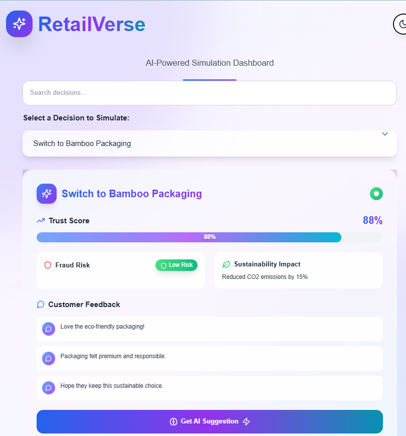
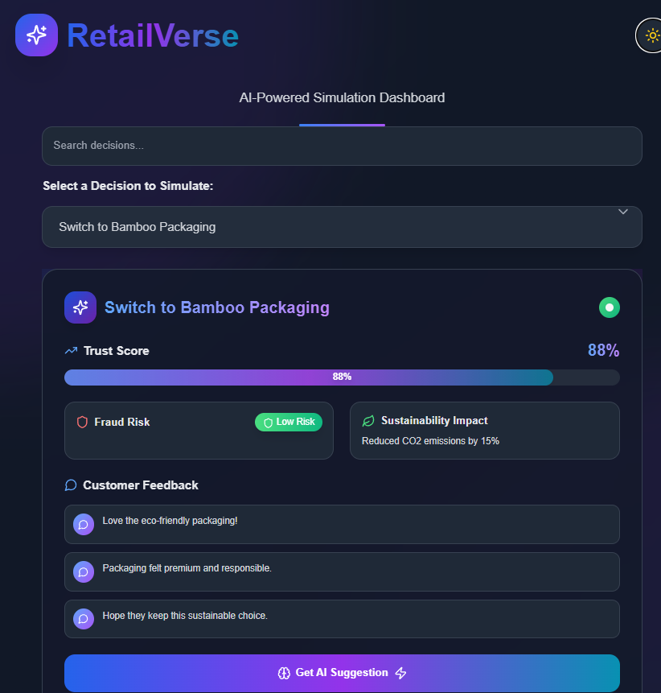
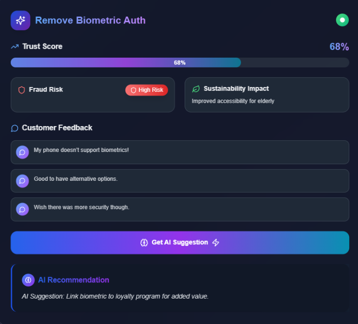

# RetailVerse: Enter the Simulation. Exit with Certainty.

RetailVerse is an AI-powered simulation and decision-support platform that helps retailers experiment with sustainable and ethical business strategies before deploying them in the real world.

## 🌱 Project Theme
**Retail with Purpose: Building a Sustainable and Responsible Future**

## Here are some visuals to give you an idea of the project:

 <!-- Replace with the actual path -->
*Figure 2: User Interface Design.*
<br><br>
<br><br>
 <!-- Replace with the actual path -->
*Figure 1: Overview of the project.*
<br><br>
<br><br>
 <!-- Replace with the actual path -->
*Figure 3: Features in action.*
<br><br>
<br><br>


## 🚀 Project Overview

RetailVerse empowers retailers to simulate decisions like:
- Switching to bamboo packaging
- Adjusting security policies (e.g., 2FA)
- Implementing new sustainability practices

...and see how these changes affect:
- ✅ Customer trust and feedback
- 🔒 Fraud risk levels
- 🌍 Environmental sustainability (CO₂ footprint)
- 📈 Overall impact on ethical governance

An AI recommendation engine (Flask backend) suggests sustainable and trust-building practices based on scenario inputs.

---

## 🧠 Key Features

- 🧪 **Interactive Simulation Engine** – Experiment with retail decisions and instantly visualize predicted outcomes.
- 🤖 **AI Recommendation Engine** – Backend module suggests sustainable practices based on predefined logic.
- 📊 **Impact Visualization** – Real-time feedback on trust score, fraud risk, and environmental metrics.
- 🔐 **Authentication** – Optional login/signup for user-based simulation history.
- 💡 **Scalable Structure** – Designed for future integration of real datasets and ML models.

---

## 🛠️ Tech Stack

**Frontend:** React, Tailwind CSS  
**Backend:** Node.js, Express.js  
**AI Module:** Python (Flask)  
**Database:** MongoDB  
**API Testing:** Postman

---

## 📂 Folder Structure

RetailVerse/
├── backend/ # Express backend with MongoDB
│ ├── routes/ # API routes (e.g., /api/auth/signup)
│ ├── models/ # Mongoose models
│ └── server.js # Entry point
├── flask-ai/ # AI recommendation engine (Flask app)
│ └── app.py
├── frontend/ # React app
│ ├── components/
│ ├── pages/
│ └── App.js
└── README.md

---

## ⚙️ Setup Instructions

### 1. Clone the repository
```bash
git clone https://github.com/your-username/RetailVerse.git
cd RetailVerse
```
### 2. Backend Setup
```bash
cd backend
npm install
node server.js
```
### 3. Frontend Setup
```bash
cd ../frontend
npm install
npm start
```
### 4. AI Flask Server
```bash
cd ../flask-ai
pip install -r requirements.txt
python app.py
```

---

## 🎯 Future Enhancements
🧠 Integrate real-world datasets for machine learning models

📈 Add analytics dashboards for business insights

🌐 Multi-scenario comparisons

🔁 Scenario history tracking for logged-in users


## Contact
LinkedIn: [https://www.linkedin.com/in/varda15]

Email: varda.hanwant03@gmail.com

## License
Distributed under the MIT License.  


